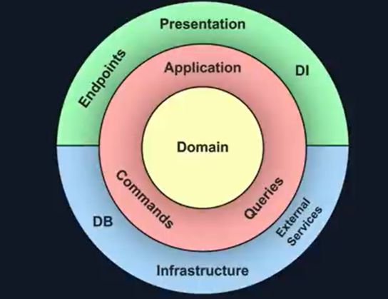
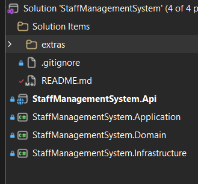
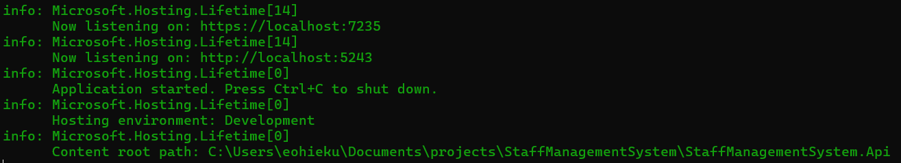

# Staff Management System

## Project Overview
A staff management system built with C# and .NET Core, leveraging Entity Framework Core as the ORM layer for seamless interaction with a SQL Server database. The system follows a clean layered architecture — separating concerns across the data, business logic, and presentation layers — with EF Core handling database migrations, schema management, and LINQ-based queries against SQL Server, ensuring type-safe, efficient data access. Built on .NET Core's cross-platform runtime, the application exposes RESTful API endpoints consumable by web or mobile frontends, with built-in support for dependency injection, middleware pipelines, and authentication via ASP.NET Core Identity or JWT-based token authorization, making it a scalable & maintainable solution.

## Sprint 1 (Milestones)
- **Create Solution Structure** [x]

	I followed this pattern and used the same hierarchy for the project references
	
	
	
	

	
