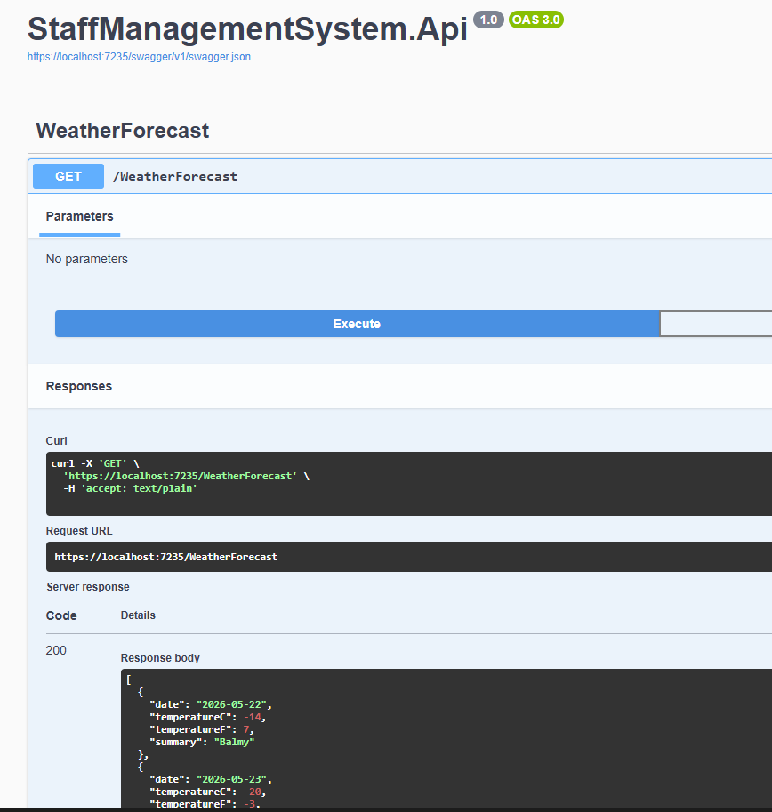
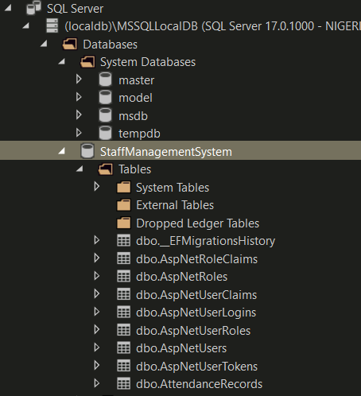
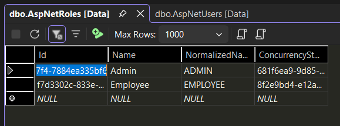
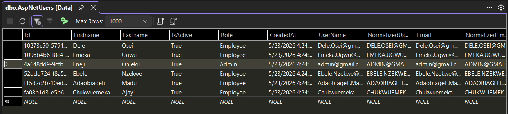
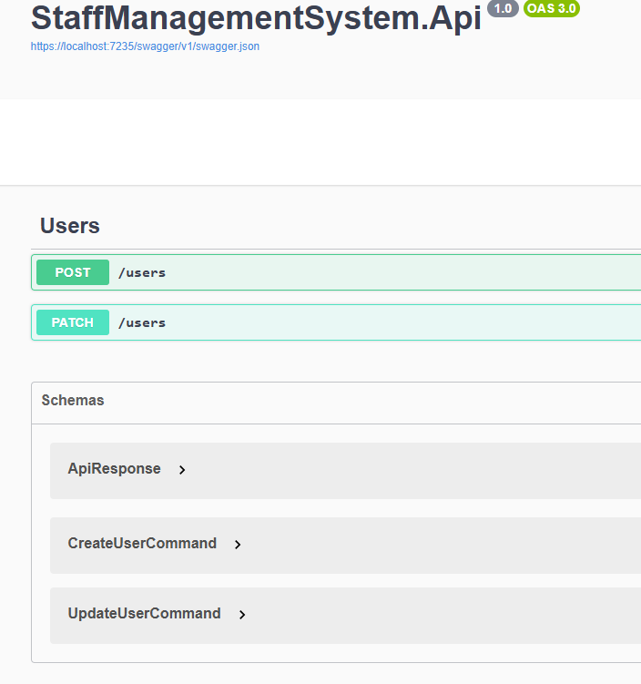

# Staff Management System

## Project Overview
A staff management system built with C# and .NET Core, leveraging Entity Framework Core as the ORM layer for seamless interaction with a SQL Server database. 
The system follows a clean layered architecture — separating concerns across the data, business logic, and presentation layers — with EF Core handling database migrations,
schema management, and LINQ-based queries against SQL Server, ensuring type-safe, efficient data access. 
Built on .NET Core's cross-platform runtime, the application exposes RESTful API endpoints consumable by web or mobile frontends, with built-in support for dependency injection, 
middleware pipelines, and authentication via ASP.NET Core Identity, making it a scalable & maintainable solution.

## Sprint 1 (Milestones)
- **Ticket 1: Create Solution Structure** ✅

	Following this pattern and I maintained the same hierarchy for the project references
	
	

	

	

	[Commit](https://github.com/peacemaker-eneji/StaffManagementSystem/commit/9ac7f894e9c6e6a433d0fb2df17d771d79267e5f)

- **Ticket 2: Setup Web API + Swagger** ✅

	Here is the swagger ui showing the Default Api Template Endpoint
	
	
	[Commit](https://github.com/peacemaker-eneji/StaffManagementSystem/commit/cfaae3ce2be80d41a6aae9242da4269304de127b)

- **Ticket 3: Add MediatR (CQRS Core)** ✅

	Added mediatR, added an AssemblyReference Class to all projects (Commands and Queries are in the Application project).
	
	[Commit](https://github.com/peacemaker-eneji/StaffManagementSystem/commit/448f038eceebdd323c4ae329747dc664dc0eb9e9)

- **Ticket 4: Define Domain Models** ✅

	Created User & AttendanceRecord Models. Used the `IEntityTypeConfiguration` to create one to many relationship from User to Attendance Record
	with a cascading `DeleteBehavior`.
	I also added a constraint to ensure that only one AttendanceRecord is created for an Employee in a Day.
	
	[Commit](https://github.com/peacemaker-eneji/StaffManagementSystem/commit/f49f207a4ae95a3d2ff87d8280335afd94f7a41b)

- **Ticket 5: Setup EF Core + Database** ✅

	Created the `AppDbContext` class, Setup up Sql Server Connection and Migration Destination. Using dotnet-ef, I created migrations and 
	Updated the Databse.

	

	[Commit](https://github.com/peacemaker-eneji/StaffManagementSystem/commit/5fe0d341eb79f42d2de31f026055857ca9b03ce9)

- **Ticket 6: Seed Initial Data** ✅

	Setup a static `DatabaseInitializer` class to seed the roles and users table. The roles were seeded on the Enum values.
	The Users was seeded with an Admin and 5 Employees. I also added automatic DB migration (If DB is deleted).

	
	

	[Commit](https://github.com/peacemaker-eneji/StaffManagementSystem/commit/2a5aeca503b38806fac0f4af65f1edd314d6867f)

- **Ticket 7: User Commands** ✅

	Created MediatR Commands to Create and Update Users using `UserManager`. Created Endpoints that can be interacted with
	in Swagger.

	
	
	[Commit](https://github.com/peacemaker-eneji/StaffManagementSystem/commit/e8b298e7350ef54ba68c1af76f09f01d7b57e05e)

- **Ticket 8: Bulk User Ingestion** ❌

	<!-- Added mediatR, added an AssemblyReference Class to all projects (Commands and Queries are in the Application project).
	
	[Commit](https://github.com/peacemaker-eneji/StaffManagementSystem/commit/9ac7f894e9c6e6a433d0fb2df17d771d79267e5f) -->

- **Ticket 9: Attendance Commands** ❌

	<!-- Added mediatR, added an AssemblyReference Class to all projects (Commands and Queries are in the Application project).
	
	[Commit](https://github.com/peacemaker-eneji/StaffManagementSystem/commit/9ac7f894e9c6e6a433d0fb2df17d771d79267e5f) -->

- **Ticket 10: Business Rules Enforcement** ❌

	<!-- Added mediatR, added an AssemblyReference Class to all projects (Commands and Queries are in the Application project).
	
	[Commit](https://github.com/peacemaker-eneji/StaffManagementSystem/commit/9ac7f894e9c6e6a433d0fb2df17d771d79267e5f) -->

	